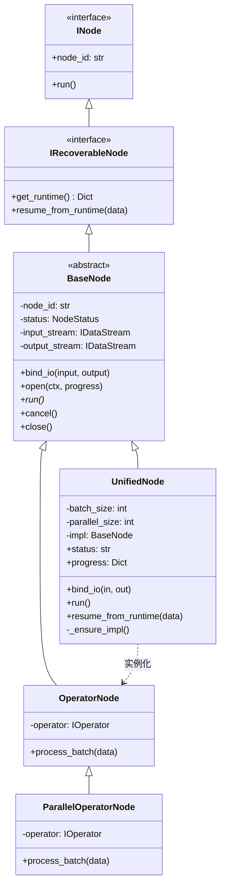
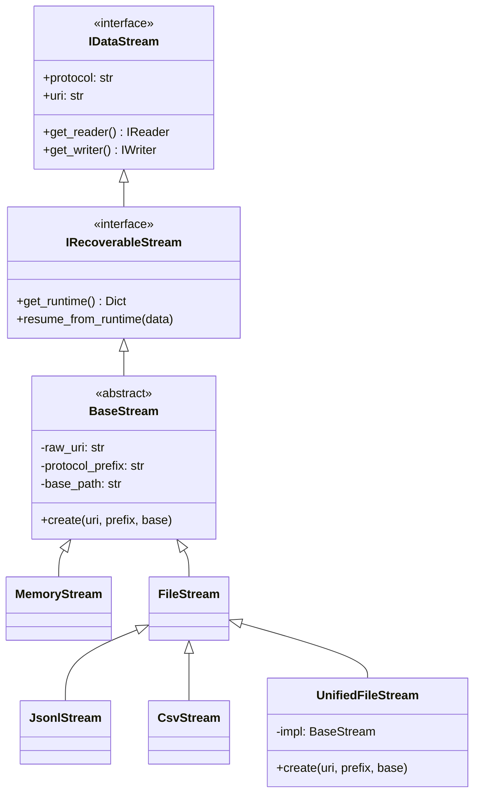
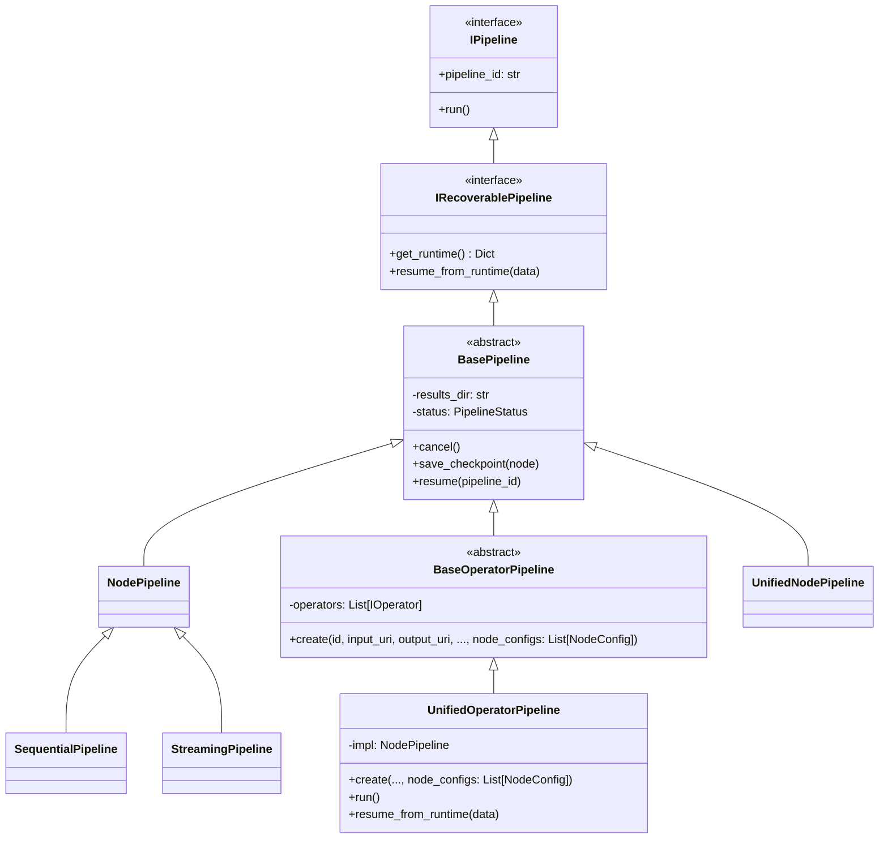

# llm-datagen 架构详解

本文档详细介绍了 llm-datagen 中 **Node（节点）**、**Bus（总线/流）** 和 **Pipeline（流水线）** 的类设计、核心特性以及生命周期流程。

---

## 1. Node 架构 (节点)

### 1.1 类图 (Class Diagram)



### 1.2 核心特性
*   **引擎自适应**：`UnifiedNode` 根据 `parallel_size` 自动切换单线程、多线程或项级并行引擎。
*   **算子多态适配**：`OperatorNode` 及其子类支持 `IBatchOperator` 和 `ISingleOperator` 的自动适配。
    *   **批次内并发**：对于仅实现 `process_item` 的单条算子，容器会自动利用 `ThreadPoolExecutor` 在批次内部开启并发执行（并发数 = `batch_size`），极大提升了传统函数的处理性能。
*   **搬运工模式 (Hauler Pattern)**：
    *   **InputNode**：从全局 URI (如 OSS) 搬运到流水线首个算子的输入。
    *   **OutputNode**：从最后一个算子的输出搬运到全局结果 URI (如 CSV)。

---

## 2. Bus (Stream) 架构 (总线)

### 2.1 类图 (Class Diagram)



### 2.2 核心特性
*   **解耦 I/O**：节点仅与 `IDataStream` 接口交互，屏蔽了 JSONL、CSV、Memory 或 OSS 的底层实现。
*   **异步批次写入器 (Asynchronous Batch Writer)**：
    *   **架构**：引入 `GenericWriter` 背景工作线程，将“业务逻辑”与“磁盘写入”彻底解耦。
    *   **背压控制**：支持 `WriterConfig` 配置，通过有界队列 (`queue_size`) 实现传输级背压，防止 OOM。
    *   **聚合策略**：支持按 `flush_batch_size` 或 `flush_interval` 自动聚合写入，优化 I/O 吞吐。
*   **早产 EOF 防御 (Premature EOF Defense)**：
    *   `StreamBridge` 具备零进度退火重试机制，确保下游 Reader 不会因为上游的极微小启动延迟 ed 误判结束。
*   **路径推导公式**：
    **`逻辑 URI` = `协议头` + `逻辑前缀` + `PipelineID` + `/` + `NodeID` + `后缀`**
*   **物理密封机制 (.done)**：
    流处理完成时自动生成 `.done` 文件。`resume` 过程中检测到该文件将跳过对应节点的重算。

---

## 3. Pipeline 架构 (流水线)

### 3.1 类图 (Class Diagram)



### 3.2 核心生命周期协同 (Lifecycle Synergy)

llm-datagen 的生命周期是一场由 Pipeline 指挥、Node 执行、Bus 封印的接力赛。

#### A. 运行模式深度流程对比

| 阶段 | **新建运行 (New Run)** | **恢复运行 (Recovery)** |
| :--- | :--- | :--- |
| **1. 启动入口** | `pipe.create(id, input, output)` | `pipe.resume(pipeline_id)` |
| **2. 拓扑构建** | **规划期**：通过 `_plan_topology` 计算路径 | **考古期**：从 `runtime.json` 还原路径 |
| **3. 物理准备** | **清场**：删除旧的中间文件与记录 | **对齐**：加载历史位点，优先覆盖内存蓝图 |
| **4. IO 激活** | **从头开始**：`Reader` 默认 `offset=0` | **断点续传**：`Reader` 定位到 `offset=N` |
| **5. 调度策略** | 顺序/流式执行所有节点 | **智能跳过**：检测到 `.done` 封条的节点直接跳过 |

#### B. 详细函数调用链路

**1. 新建运行 (New Run Flow)**

```text
1. [声明期] pipe = UnifiedPipeline(operators=[op1])
   │
   └── Pipeline.__init__(): 
        └── 存储 [op1]，初始化 Hooks 容器

2. [规划期] pipe.create(pipeline_id="my_task", input_uri="...", output_uri="...")
   │
   ├── self._plan_topology(): 生成逻辑蓝图字典 (nodes=[input, node_0, output])
   │
   ├── self._weld_topology(): 
   │    └── 推导中间 URI: "jsonl://my_task/node_0.jsonl"
   │
   ├── self._materialize_topology(): 【核心：实例化物理对象】
   │    │
   │    ├── FOR node_plan IN plans:
   │    │    ├── Bus (Stream) 诞生: StreamFactory.create(uri)
   │    │    │    └── [Bus 内部]: 记录物理路径，解析存储协议
   │    │    │
   │    │    ├── Node 诞生: UnifiedOperatorNode(operator, ...)
   │    │    │    └── [Node 内部]: 记录配置 (batch_size等)，状态设为 PENDING
   │    │    │
   │    │    └── 焊接 IO: node.bind_io(in_bus, out_bus)
   │    │         └── [Node 内部]: 建立引用关系 (self._input_stream = in_bus)
   │    │
   │    └── 生成 _nodes 列表 (Node 实例集合)
   │
   ├── self._impl = SequentialPipeline(nodes=self._nodes) 【选型执行引擎】
   │
   └── self._clear_streams_if_needed(): 
        └── [Bus 调用]: node.output_stream.clear_data() -> 物理删除旧文件

3. [执行期] pipe.run()
   │
   ├── Pipeline.open(): 【环境激活】
   │    ├── self.save_runtime(): 物理写入 runtime.json (蓝图落盘)
   │    └── FOR node IN nodes: 
   │         └── node.set_context(ctx): 注入监控、日志和存盘函数
   │
   ├── FOR node IN nodes: 【调度循环】
   │    │
   │    ├── node.open(): 【IO 激活】
   │    │    ├── [Bus 调用]: stream.open() -> 检查/创建目录
   │    │    ├── [Bus 调用]: stream.get_reader() -> 创建磁盘读取句柄 (offset=0)
   │    │    └── [Bus 调用]: stream.get_writer() -> 创建磁盘写入句柄
   │    │
   │    ├── node.run(): 【核心处理循环】
   │    │    └── WHILE data := reader.read():
   │    │         ├── node.process_batch(data):
   │    │         │    └── [Operator 调用]: operator.process_batch(data) 【业务逻辑】
   │    │         │
   │    │         ├── writer.write(result): 写入 Bus
   │    │         │
   │    │         └── Pipeline.save_checkpoint(node): 自动更新进度到 runtime.json
   │    │
   │    └── node.close(): 【节点结项】
   │         ├── [Bus 调用]: reader/writer.close() -> 释放句柄
   │         └── [Bus 调用]: stream.seal() -> 贴上 .done 封条 (物理创建 done 文件)
   │
   └── Pipeline.close(): 打印最终分析报告，标记整个 Pipeline 为 SUCCESS
```

**2. 恢复运行 (Recovery Flow)**

```text
1. [声明期] pipe = UnifiedPipeline(operators=[op1])
   │
   └── [同新建]: 此时只持有算子逻辑，还没有物理路径

2. [恢复期] pipe.resume(pipeline_id="my_task") 【替代了 create】
   │
   ├── READ runtime.json: 从磁盘加载“前世”留下的快照数据
   │
   ├── self._reconstruct_topology(): 【骨架重构】
   │    ├── FOR node_state IN runtime_data:
   │    │    ├── Bus 恢复: StreamFactory.create(node_state["output_uri"])
   │    │    ├── Node 恢复: UnifiedOperatorNode(operator, ...) 【重新实例化】
   │    │    └── node.bind_io(in_bus, out_bus)
   │    └── 重组物理 _nodes 列表
   │
   └── self.resume_from_runtime(): 【记忆注入】
   │    └── FOR node IN nodes:
   │         └── node.resume_from_runtime(state):
   │              ├── [Node 内部]: status = RESUMING
   │              └── [Node 内部]: current_progress = 500 【记住断点位点】

3. [执行期] pipe.run()
   │
   ├── Pipeline.open(): 【同新建，但不会清空数据】
   │
   ├── FOR node IN nodes: 【智能调度循环】
   │    │
   │    ├── IF node.status == COMPLETED:
   │    │    └── CONTINUE 【跳过已完成节点，Bus 不会被打开】
   │    │
   │    ├── node.open(progress=500): 【IO 偏移激活】
   │    │    ├── [Bus 调用]: stream.open()
   │    │    ├── [Bus 调用]: stream.unseal() -> 撤销之前的封条，允许续写
   │    │    └── [Bus 调用]: stream.get_reader(offset=500) -> ◀️ 关键：Seek 到指定行
   │    │
   │    ├── node.run(): 【断点续传】
   │    │    └── [同新建逻辑]: 从 500 行开始继续往下处理
   │    │
   │    └── node.close(): 贴上最终封条
   │
   └── Pipeline.close()
```

### 3.3 物理封条机制 (.done) 的深层设计

封条是 llm-datagen 实现“物理级”确定性的关键。

#### A. 谁来贴封条？
*   **触发者**：**Node**。当 Node 检测到自己的 `run()` 任务完成时，**必须第一时间**调用 `self.close()`。
*   **传递者**：**Writer**。Node 关闭会导致内部 `_writer.close()` 被触发。
*   **执行者**：**Storage**。最终由 `Storage.mark_finished()` 在磁盘上创建物理文件。

#### B. 封条的双重价值
1.  **流式驱动 (Parallel Engine)**：下游节点的 Reader 基于封条判定上游已结束，从而安全地排干数据并退出，彻底杜绝并行模式下的“进程挂起”现象。
2.  **事务提交 (Sequential Engine)**：封条标记了该步骤的原子性。在 `resume` 过程中，只有带有封条的节点输出才被视为合法的中间资产，否则会被清空并重跑。

---

## 4. 配置模型 (Configuration Models)

### 4.1 NodeConfig
用于在 `Pipeline.create` 时对特定节点进行精细化控制。

```python
@dataclass
class NodeConfig:
    batch_size: Optional[int] = None      # 批大小
    parallel_size: Optional[int] = None   # 并发数
    input_uri: Optional[str] = None       # 覆盖输入路径
    output_uri: Optional[str] = None      # 覆盖输出路径
    protocol_prefix: Optional[str] = None # 协议前缀
    base_path: Optional[str] = None       # 物理底座路径
    extra: Optional[Dict[str, Any]] = None # 算子自定义参数
```

### 4.2 WriterConfig
用于控制异步写入策略与背压：

```python
@dataclass
class WriterConfig:
    async_mode: bool = False      # 是否开启异步背景写入
    queue_size: int = 5000        # 写入队列上限 (背压阀值)
    flush_batch_size: int = 100   # 内存累积多少条后执行物理写入
    flush_interval: float = 1.0   # 强制刷盘的时间间隔 (秒)
    retry_interval: float = 0.1   # 轮询空队列的间隔
```

---

## 5. 设计哲学与核心隐喻 (Design Philosophies)

llm-datagen 的设计并非随机组合，而是基于一套经过实战检验的“心法”：

### 5.1 雇主-雇员模型 (Employer-Employee Model)
*   **隐喻**：Pipeline 是“雇主”，Node 和 Bus 是“雇员”。
*   **逻辑**：不再是 Bus 问 Pipeline“我能做什么”，而是 Pipeline 拿着一张“准入协议清单”（Protocols）去面试 Bus。只有持证（支持对应 Protocol ABC）的组件才能进入流水线。
*   **价值**：实现了极致的解耦，增加新存储协议（如 S3）时，Pipeline 一行代码都不用改。

### 5.2 复杂度阶梯 (Complexity Ladder)
我们故意将功能拆解，为开发者提供平滑的选型路径：
1.  **初级 (Sequential + Memory)**：零配置，纯内存，用于快速本地验证。
2.  **进阶 (Streaming + Memory)**：高并发流处理，处理实时数据，不追求恢复。
3.  **高级 (Recoverable Sequential)**：处理极其昂贵、必须 100% 成功的 LLM 批处理。
4.  **旗舰 (Recoverable Streaming)**：工业级流水线，兼顾并发、低延迟和高可用。

### 5.3 路径优先级矩阵 (Path Priority)
1.  **P1 (最高) - Node 显式指定**：开发者手动指定的 URI，Pipeline 必须绝对尊重，严禁静默覆盖。
2.  **P2 (次高) - Pipeline 边界参数**：仅在首尾节点的对应 URI 为空时进行按需填充。
3.  **P3 (最低) - 自动推导**：中间链路根据 `pipeline_id` 自动焊接推导。

---

## 6. 路径管理逻辑 (Path Management)

llm-datagen 采用“外不受限，内有收纳”的设计哲学，通过 `base_path` 和 `protocol_prefix` 实现对物理存储与逻辑协议的精控。

### 路径控制字段总结

| 特性 | **`base_path`** (物理底座) | **`protocol_prefix`** (协议底座) |
| :--- | :--- | :--- |
| **作用层级** | **物理磁盘层** (`os.path.join`) | **逻辑地址层** (`BaseStream.uri`) |
| **生效方式** | 控制文件在硬盘上的真实物理位置 | 控制访问数据的协议头和逻辑命名空间 |
| **外部端点 (I/O)** | **不应用** (尊重用户指定的原始路径) | **不应用** (确保数据源/宿的物理独立性) |
| **内部资产 (中间数据)** | **应用** (自动收纳到该目录下的 ID 文件夹) | **应用** (将中间结果一键重定向到指定协议) |
| **典型示例** | `tmp/storage/` | `oss://my-bucket/workspace/` |
| **核心价值** | **收纳**：避免中间文件散落在项目根目录 | **迁移**：实现 Pipeline 从本地到云端的“无缝空降” |

---

## 7. 数据包络与 ID 连续性 (Data Envelope)

为了解决 1:N 场景下的 ID 爆炸和嵌套问题，llm-datagen 确立了 **“Bus 剥壳、Node 纯净、ID 继承”** 的契约：

*   **Bus 剥壳 (Unboxing)**：Reader 读取物理文件（带 `_i`）后，自动剥离外壳，交给 Node 的是纯净的业务数据。
*   **ID 继承 (Inheritance)**：Writer 接收结果。如果是 1:1 处理，**直接复用原 ID**；如果是 1:N，生成衍生 ID（如 `10_0`）。
*   **防套娃机制**：物理存储始终只有一层包络 `{"_i":..., "data":...}`，杜绝了 `data: { data: ... }` 的嵌套。

---

## 8. 弹性与容错

*   **超时退火 (Timeout & Backoff)**：LLM 调用内置指数退火重试（默认 2 次），应对 Rate Limit。
*   **超时阻塞保护**：流读取（`read`）和通道等待（`wait`）均设有 `timeout` 参数，防止整链挂起。
*   **背压控制**：在并行节点引入 `Semaphore` 限制积压任务数（默认 `parallel_size`），将崩溃时潜在的数据丢失风险控制在极小范围内，同时防止内存溢出。

---

## 9. 状态机与生命周期 (Status & Lifecycle)

llm-datagen 采用了一套强一致性的状态机管理机制，确保 Pipeline 与 Node 的行为在正常执行、故障恢复、手动取消等场景下高度可预测。

### 7.1 核心状态定义
*   **PENDING (等待)**: 初始蓝图已就绪，物理资源尚未加载。
*   **RESUMING (恢复中)**: 识别到历史位点，正在进行指针寻址 (Seek)。
*   **RUNNING (运行中)**: 正在进行批次处理或流式传输。
*   **CANCELING (取消中)**: 捕获到中断信号 (SIGINT/SIGTERM)，正在进行收尾清理。
*   **CANCELED (已取消)**: 清理完成，物理连接已安全断开。
*   **COMPLETED (已完成)**: 数据全部处理完毕，已打上物理封条 (`.done`)。
*   **FAILED (失败)**: 发生未捕获异常，任务中断，已记录错误详情。

### 7.2 状态流转流程图

| 动作阶段 | Pipeline 状态 | Node 状态 | 关键物理行为 |
| :--- | :--- | :--- | :--- |
| **蓝图编排 (Create)** | `PENDING` | `PENDING` | 清理旧的 `checkpoint.json` 和 `report.json`。 |
| **恢复初始化 (Resume)** | `RESUMING` | `RESUMING` | 加载磁盘位点，优先覆盖内存蓝图。 |
| **节点开启 (Open)** | `RUNNING` | `RUNNING` | 记录 `🎬 节点开启`；撤销历史封条 (`unseal`)。 |
| **运行中 (Run)** | `RUNNING` | `RUNNING` | **抢占式存盘**：读到数据即存进度，保证 At-Most-Once。 |
| **优雅取消 (Cancel)** | `CANCELING` | `CANCELING` | 设置中断 Event，抛出 `InterruptedError` 触发收尾。 |
| **任务终结 (Close)** | `COMPLETED` | `COMPLETED` | 记录 `🏁 结束`；生成物理封条 (`.done`)。 |

---

## 10. 结语

目前的 llm-datagen 架构实现了 **“无状态 Bus + 有状态 Node + 蓝图化 Pipeline”** 的三层解耦。系统不再依赖于运行时的偶然性，而是通过严密的物理封条、实时的检查点存盘和镜像级的重构机制，确保了数据生成过程的绝对可观测与可恢复性。
